# 1. Sobre o Curso

------------------------------------------------------------------------

## 🎯 Objetivo

<br><br> Introduzir estudantes de iniciação científica, pós-graduação e pesquisadores ao uso da ciência de dados na pesquisa em saúde.

## Módulos

-   Módulo 1: Ferramentas, linguagens e possibilidades (12h)\
-   Módulo 2: Manipulação de dados, visualização e bioestatística com o R (12h) (Set)
-   Módulo 3: Machine learning na saúde (12h) (Nov)
-   Módulo 4: Projeto de aplicação (4h)\

### 💻 Conteúdo Programático do Módulo 1

1.  Introdução à Ciência de Dados (Teoria)

2.  Introdução ao uso do R  e RStudio  (Prática)

3.  Fundamentos da linguagem R (Teoria)

4.  Controle de versões Git/GitHub  (Prática)

5.  Criação de apresentações, relatórios, web-sites, artigos, teses, dashboards e aplicativos web (Prática)

# Projeto Saúde Data Science

## Objetivo

<br>

Criar oportunidades de interação dialógica com a sociedade por meio da elaboração de produtos de dados associados à ciência de dados.

------------------------------------------------------------------------

Equipe do Projeto *Saúde Data Science*\
Projeto de Extensão UFR Nº 696/2025


# 2. Introdução

------------------------------------------------------------------------

## O que é ciência de dados (*Data Science*)

<br>

::: {style="text-align: justify;"}
<p>Campo acadêmico interdisciplinar que utiliza estatística, computação científica, métodos científicos, processos, algoritmos e sistemas para extrair ou extrapolar conhecimento e <em>insights</em> de **dados ruidosos**, **estruturados** e **não estruturados** (Dhar, 2013).</p>
:::

------------------------------------------------------------------------

::: panel-tabset
#### 📊 Estruturados

```{r}
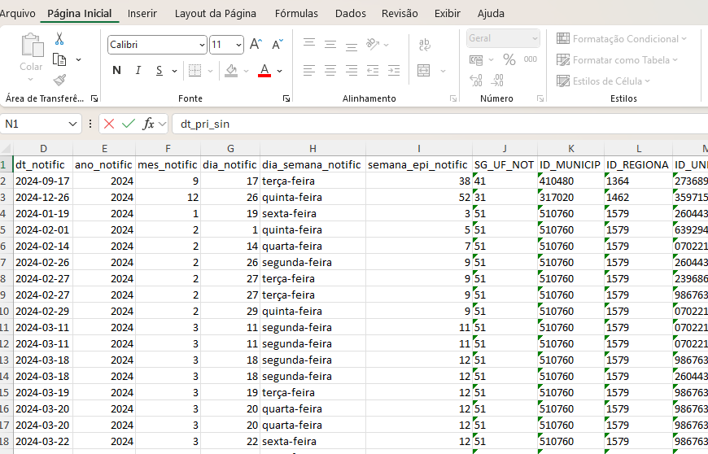
```

#### 🧾 N. Estruturados

```{r}
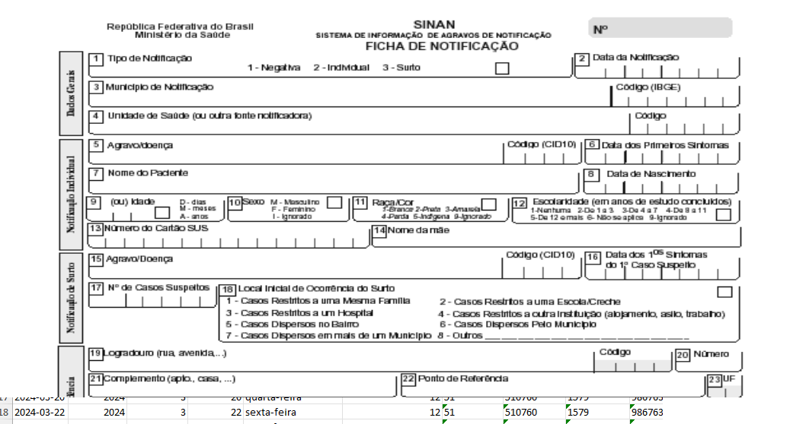
```

#### 📉 Ruidosos

```{r}
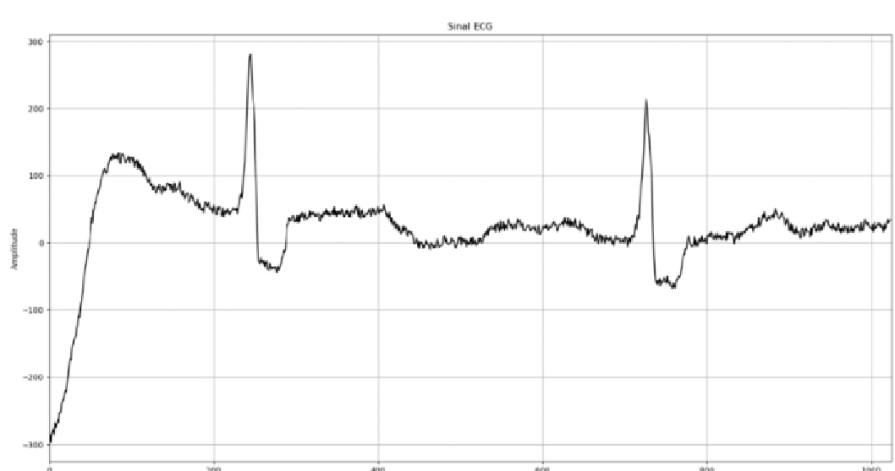
```
:::

------------------------------------------------------------------------

A ciência de dados está relacionada com

-   **Big Data**\
-   **Mineração de Dados (*Data Mining*)**\
-   **Aprendizagem de Máquina (*Machine Learning*)**

## Mineração de Dados <br> (*Data Mining*)

<br>

::: {style="text-align: justify; font-style: italic; border-left: 4px solid #ccc; padding-left: 3em; margin-top: 1em;"}
“É o processo de extrair e descobrir padrões em grandes bancos de dados envolvendo métodos relacionados à aprendizagem de máquina, estatística e sistemas de bancos de dados.” Wikipedia

<br>

É o processo de descobrir automaticamente informação útil em grandes repositórios de dados (Tan et al., 2005)
:::

## Histórico do *Data Mining* {.smaller}

-   **Década de 1960-70**: Surgimento dos primeiros bancos de dados e linguagens de consulta (ex: SQL).
-   **Década de 1980**: Avanços em armazenamento e recuperação de dados; algoritmos de aprendizado simbólico.
-   **Década de 1990**: Popularização do termo *data mining*; surgimento de ferramentas comerciais (ex: IBM Intelligent Miner, SAS Enterprise Miner).
-   **2000s**: Integração com *big data*, algoritmos escaláveis, mineração de dados em tempo real.
-   **2010s em diante**: Consolidação como parte da ciência de dados; uso intensivo de aprendizado de máquina e redes neurais.

## Aprendizagem de Máquina <br> (*Machine Learning*)

-   Consiste em desenvolver algoritmos que permitem os computadores aprenderem dos dados e tomarem decisões baseadas em dados\

-   Surgiu na década de 1950\

-   

    > **Arthur Samuel (1959)** definiu *machine learning* como:\
    > "o campo de estudo que dá aos computadores a habilidade de aprender sem serem explicitamente programados."

------------------------------------------------------------------------

| Aspecto | Mineração de Dados | Aprendizagem de Máquina |
|------------------|---------------------------|---------------------------|
| **Objetivo principal** | Extrair padrões úteis e conhecimento de dados | Fazer previsões ou tomar decisões com base em dados |
| **Enfoque** | Exploração e descoberta de padrões em grandes conjuntos de dados | Generalização para novos dados a partir de exemplos passados |
| **Tarefa típica** | Agrupamento, associação, descoberta de regras | Classificação, regressão, clustering supervisionado |
| **Motivação original** | Análise de grandes volumes de dados corporativos | Construção de algoritmos que aprendem automaticamente |
| **Uso comum em** | Negócios, marketing, banco de dados | Inteligência artificial, robótica, sistemas autônomos |
| **Base técnica** | Estatística + banco de dados + ML | Estatística + algoritmos + computação |

## Por que Ciência de Dados na Pesquisa em Saúde?

------------------------------------------------------------------------

## O processo da Ciência de Dados é muito semelhante ao da pesquisa quantitativa

------------------------------------------------------------------------

::: {style="text-align: justify;"}
> As mudanças tecnológicas que iniciaram na década de 50, e se intensificaram em 1990 e em 2020, mudaram o material empírico e o fazer científico.
:::

------------------------------------------------------------------------

{fig-align="center"}

------------------------------------------------------------------------

### Uso da ciência de dados na pesquisa em saúde

<br><br>

| Termos de busca (google scholar) | Resultados |
|----------------------------------|------------|
| "machine learning" e "health"    | 4.800.000  |
| "data mining" e "health"         | 5.440.000  |
| "data science" e "health"        | 7.270.000  |

------------------------------------------------------------------------

-   Em geral, o uso da ciência de dados na pesquisa:
    -   amplia o alcance
    -   aumenta o rigor
    -   eleva o impacto real

## Ciência de Dados na Pesquisa: repensar o fazer científico

------------------------------------------------------------------------

1.  Implicações da era do Big Data
2.  Implicações dos desenvolvimentos em ML, DM e IA
3.  Implicações do uso de linguagem de programação
4.  Efeitos potenciais na pesquisa universitária

::: {style="position: absolute; bottom: 10px; left: 0; width: 100%; text-align: center; opacity: 0.3; font-size: 1.2em;"}
Ciência de Dados na Pesquisa: repensar o fazer científico
:::

------------------------------------------------------------------------

### Big Data e a revolução dos dados {.smaller}

-   Dados administrativos se tornaram dados secundários de pesquisa
    -   Ex: Registros eletrônicos do **e-SUS**, **SIH/SUS**, **SINAN** e **SIVEP**
-   Dados não usuais tornaram-se mais acessíveis
    -   Ex: prescrições médicas, áudios de consultas, imagens de exames, etc.
-   Dispositivos e sistemas passaram a gerar outros dados
    -   Ex: Dados oriundos de dispositivos vestíveis (wearables) e apps de saúde

------------------------------------------------------------------------

### Machine Learning, Data Mining e Inteligência Artificial {.smaller}

-   Novas e melhores ferramentas de análise
    -   Análise de dados não estruturados
        -   Ex: textos, imagens, vídeos
    -   Mineração
    -   Predição
        -   Ex: Predição da mortalidade hospitalar
    -   Classificação
        -   Ex: Algoritmo de classificação baseado em deep learning para detectar retinopatia diabética
    -   Agrupamento
        -   Ex: Identificar subgrupos de pacientes com insuficiência cardíaca congestiva com base em características clínicas, visando apoiar tratamentos personalizados

------------------------------------------------------------------------

### Uso de uma linguagem de programação {.smaller}

-   Aumenta a **reprodutibilidade** e **transparência** (exemplo: github)
-   Melhora a **comunicação dos resultados** (exemplo: preliminar e desenho)
-   Melhora o diálogo entre grupos de pesquisa (exemplo: [aplicativo web](https://djalmabarbosa.shinyapps.io/TematicoApp/))
-   Melhora o fluxo de orientação/mentoria
-   Fortalece a **ciência aberta** e a **confiança pública**
-   Viabiliza formação interdisciplinar
-   Permite interação mais natural com ferramentas de IA (exemplo: chatgpt)

## Uso da IA como assistente de pesquisa {.smaller}

------------------------------------------------------------------------

-   Aceleração da codificação
    -   Geração rápida de funções e scripts com base em linguagem natural
    -   Sugestões otimizadas de código para evitar erros
-   Melhora na organização do fluxo de análise de dados
    -   Visualizações exploratórias automatizadas
    -   Criação de pipelines de pré-processamento

::: {style="position: absolute; bottom: 10px; left: 0; width: 100%; text-align: center; opacity: 0.3; font-size: 1.2em;"}
Uso da IA como assistente de pesquisa
:::

------------------------------------------------------------------------

-   Auxilia na documentação e reprodutibilidade
    -   Comentários automáticos e claros no código
    -   Templates para RMarkdown, Quarto, Jupyter etc.
-   Auxílio em análises estatísticas e modelagem
    -   Sugestões e explicações de testes estatísticos
    -   Comparação de modelos
    -   Auxilia na construção de simulações
    -   Ajuda a encontrar erros no código (debug)

::: {style="position: absolute; bottom: 10px; left: 0; width: 100%; text-align: center; opacity: 0.3; font-size: 1.2em;"}
Uso da IA como assistente de pesquisa
:::

------------------------------------------------------------------------

-   Auxilia na divulgação dos resultados
    -   Templates para formatação de monografias, dissertações e teses
    -   Eloboração de produtos de dados
-   Pode acelerar o aprendizado
    -   Explicações sob demanda de sintaxe e conceitos estatísticos
    -   Referência a pacotes, funções e boas práticas
    -   Respostas a perguntas avançadas de modelagem e dados

::: {style="position: absolute; bottom: 10px; left: 0; width: 100%; text-align: center; opacity: 0.3; font-size: 1.2em;"}
Uso da IA como assistente de pesquisa
:::

## Fortalecimento da relação entre Pesquisa, Extensão e Inovação

------------------------------------------------------------------------

-   Novas possibilidade de pesquisas com aplicações práticas
-   Análise de dados em tempo real
-   Criação de produtos tecnológicos (produtos de dados)
-   Maior protagonismo do estudante
-   Oportunidade de formação interprofissional
-   Maior empregabilidade

::: {style="position: absolute; bottom: 10px; left: 0; width: 100%; text-align: center; opacity: 0.3; font-size: 1.2em;"}
Fortalecimento da relação entre Pesquisa, Extensão e Inovação
:::

## Por que a linguagem/software R

------------------------------------------------------------------------

-   O R é uma linguagem de programação *funcional*

-   As funções são armazenadas em pacotes

    -   Pacotes básicos + pacotes instaláveis
    -   Mais de 16.000 pacotes (2020)

-   O software e a linguagem *gratuitos*

-   Pode ser utilizado em diversos sistemas operacioanais

::: {style="position: absolute; bottom: 10px; left: 0; width: 100%; text-align: center; opacity: 0.3; font-size: 1.2em;"}
Por que a linguagem/software R
:::

------------------------------------------------------------------------

-   Possui uma comunidade de colaboração ativa

-   Possui um sistema de 'controle de qualidade'

-   É a linguagem preferida dos estatísticos

-   É uma das linguagens de análise estatísticas mais utilizadas no mundo

-   Viabiliza o trabalho IA integrada

::: {style="position: absolute; bottom: 10px; left: 0; width: 100%; text-align: center; opacity: 0.3; font-size: 1.2em;"}
Por que a linguagem/software R
:::

# 3. Usando o R!

------------------------------------------------------------------------

## Prática: Baixar e instalar o R

------------------------------------------------------------------------

<https://cran.r-project.org/bin/windows/base/>

------------------------------------------------------------------------

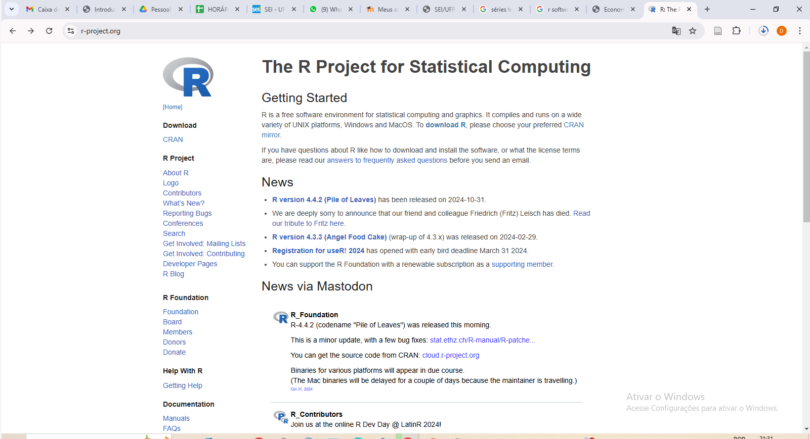

------------------------------------------------------------------------

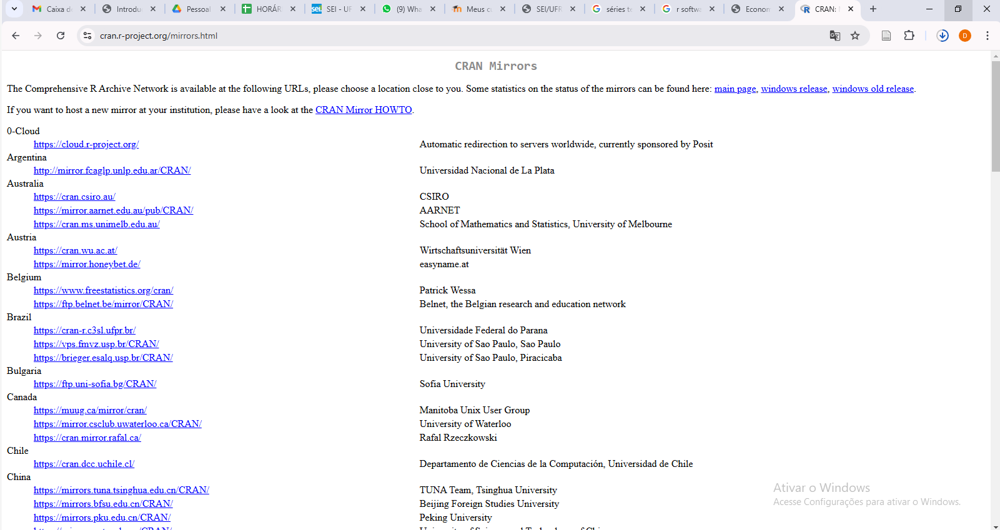

------------------------------------------------------------------------

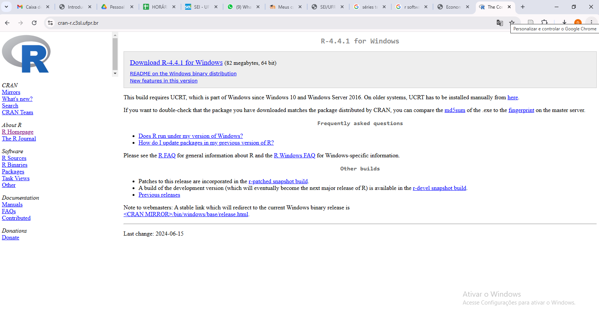

------------------------------------------------------------------------

### Inserindo código diretamente no console do R

------------------------------------------------------------------------

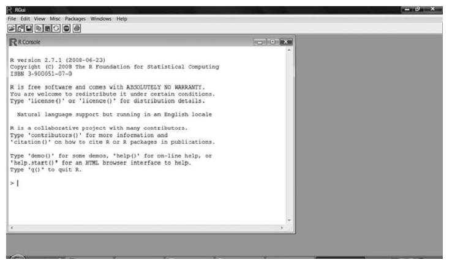

### Prática: baixar e instar o RStudio

### 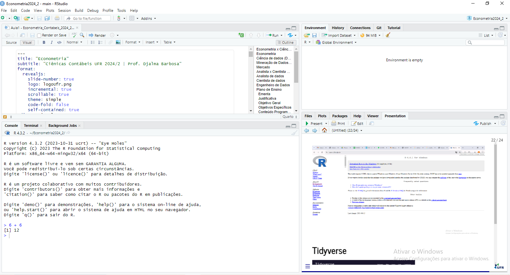

### Como usar o RStudio

1.  Escrevendo no console
2.  Utilizando seus tipos de arquivo
    -   R Sript (simples e útil)
    -   RMarkdown
    -   Quarto\
3.  Utilizando projetos
4.  Integrando o GitHub
5.  Com um co-piloto (IA)

## Escrevendo no painel *console* do RStudio

------------------------------------------------------------------------

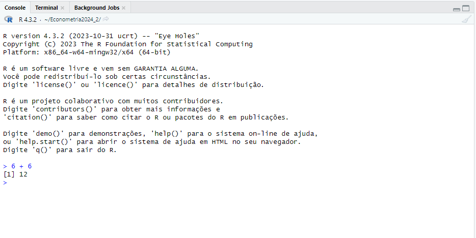

## Utilizando *R scripts*

------------------------------------------------------------------------

-   Um *script* é um texto em forma de comandos (códigos), que o R interpreta como uma ação a ser executada.
-   É um roteiro de execução
-   Executa código sequencialmente
-   É o arquivo utilizado pelo R, quando não se usa o RStudio

::: {style="position: absolute; bottom: 10px; left: 0; width: 100%; text-align: center; opacity: 0.3; font-size: 1.2em;"}
Escrevendo um *R script*
:::

------------------------------------------------------------------------

[*Prática*]{.azul}

::: {.callout style="border-left: 4px solid #198754; background-color: #e6f4ea;"}
<br>

Clique em: *Menu* \> *File \> New File \> R Script*

Escreva no seu R Script: 2+2

Coloque o cursor do mouse na linha com o código e clique em 'Run'.

Para salvar: *File \> Save*

<br>
:::

------------------------------------------------------------------------

Em geral os *scripts* possuem os seguintes elementos:

| Termo | Sinônimos | Descrição |
|------------------|----------------------|--------------------------------|
| Base de dados | *dataframe*, Banco de dados | Estrutura que armazena dados |
| Variável | *Column*, Coluna | Campo que armazena valores para análise |
| Linha | *Row*, Observação, Registro | Cada entrada ou conjunto de valores |
| **Função** | Verbo, Comando | Ação que o R executa |
| Argumento | Parâmetro | Define opções dentro de uma função |
| Output | Resultado | Retorno gerado pelo código |

------------------------------------------------------------------------

### Funções

------------------------------------------------------------------------

::: {.callout-note style="background-color:#dceeff;"}
-   O R é uma linguagem funcional
-   Funções vêm associadas a parênteses `( )`, onde colocamos os *argumentos da função*.
-   Exemplos da matemática:\
-   $y = f(x)$
-   $z = f(x, y)$ ... [Latex]{.verde}
-   A função mais simples no R é a criação de um conjunto de valores (*vetor*)
:::

------------------------------------------------------------------------

### [*Prática*]{.azul}

``` r
# Soma 2 com 2
2+2

# Cria o vetor x
x <- c(1,1,2,3,5,8) # define o objeto x

mean(x) # Calcula a media de x
```

------------------------------------------------------------------------

### Utilizando pacotes (*packages*) <br> [*Prática*]{.azul}

------------------------------------------------------------------------

-   Instalando com 'click' *Tools, Install Packages*.

-   Com comando:

    ``` r
    install.packages("tidyr")
    ```

-   Carregando o pacote instalado

    ``` r
    library(tidyr)
    ```

    -   Você sempre precisará recarregar os novos pacotes após encerrar uma seção

-   Verificando os pacotes instalados

    ``` r
    sessionInfo()
    ```

-   Atualizando pacotes

------------------------------------------------------------------------

#### Tidyverse

------------------------------------------------------------------------

::: panel-tabset
#### Filosofia

```{r Tidyverse}
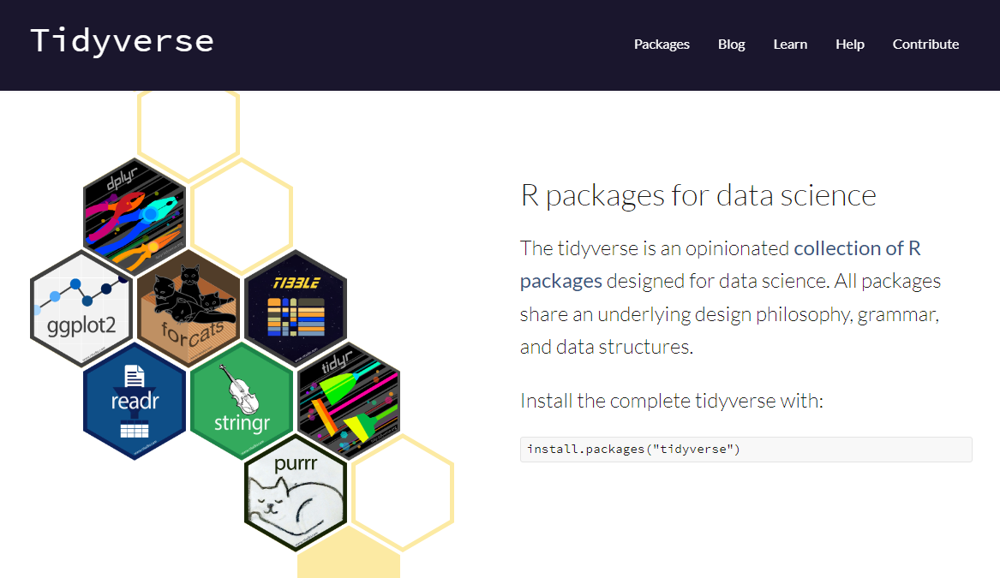
```

#### Pacotes do Tidyverse

```{r Pacotes do Tidyverse}
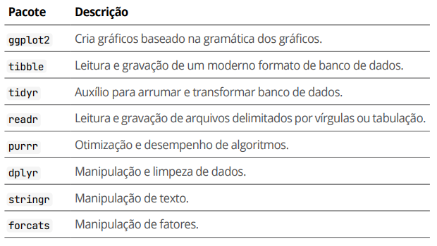
```
:::

------------------------------------------------------------------------

O *tidyverse* é um metapacote que segue uma filosofia de design, gramática e estruturas de dados em comum para que diversos pacotes úteis para a ciência de dados possam ser utilizados em cojunto

------------------------------------------------------------------------

#### [*Prática*]{.azul}

Vamos instalar e carregar os pacotes do *tidyverse*

``` r
if(!require(tidyverse)) install.packages("tidyverse") 

library(tidyverse)

# Agora podemos usar uma função 'tible' que faz parte do tidyverse

y <- c(1,2,3,4,5,6)

tibble(x,y) # retorna o objeto no console

dados <- tibble(x,y)
```

------------------------------------------------------------------------

### Dicas de organização do *script*

------------------------------------------------------------------------

### ❌ Bagunçado

``` r
library(dplyr)
dados=data.frame(nome=c("Ana","Bruno","Carlos","Daniela"),idade=c(23,35,31,28),salario=c(2500,4200,3900,3100))
dados_filtrados=dados%>%filter(salario>3000)
media_idade=mean(dados_filtrados$idade)
print(dados_filtrados)
```

### ✅ Organizado

``` r
# Carrega pacotes necessários
library(dplyr)

# Cria um dataframe de exemplo
dados <- data.frame(
  nome = c("Ana", "Bruno", "Carlos", "Daniela"),
  idade = c(23, 35, 31, 28),
  salario = c(2500, 4200, 3900, 3100)
)

# Filtra pessoas com salário acima de 3000
dados_filtrados <- dados %>%
  filter(salario > 3000)

# Calcula a média de idade das pessoas filtradas
media_idade <- mean(dados_filtrados$idade)

# Exibe os dados filtrados e a média de idade
print(dados_filtrados)
```

------------------------------------------------------------------------

::: {.callout-tip style="background-color:#e6ffe6;"}
``` r

# Verificando o diretório de trabalho
getwd()
```
:::

## Usando o R Markdown <br> [*Prática*]{.azul}

------------------------------------------------------------------------

::: {.callout-note style="background-color:#dceeff;"}
Crie um novo arquivo clicando em: **File \> New File \> R Markdown...**

Escolha um título, autor e selecione o formato desejado (HTML, PDF, Word).
:::

------------------------------------------------------------------------

-   R Markdown é uma ferramenta que permite combinar **texto formatado** com **código executável**.
-   É um documento dinâmico
-   Ideal para **relatórios reprodutíveis**, **análises**, **artigos científicos** e **apresentações**.
-   Usa o formato `.Rmd`.
-   Para compilar, clique em `Knit`.

------------------------------------------------------------------------

## Estrutura básica de um arquivo R Markdown

``` text
---
title: "Meu primeiro R Markdown"
author: "Seu Nome"
date: "`r Sys.Date()`"
output: html_document
---

## Introdução

Texto explicativo aqui.

Códigos nas chuncks
{r chunk do r}
```

------------------------------------------------------------------------

::: {.callout-tip style="background-color:#e6ffe6;"}
Atalho para criar uma nova chunk: Ctrl + Alt + i
:::

### Principais componentes de um R Markdown {.smaller}

| Elemento | Exemplo | Descrição |
|-----------------------|-----------------------|---------------------------|
| **Texto** | Markdown | Escrita formatada (títulos, listas, negrito, etc.) |
| **Código R** | `{r plot(x)`} | Código que será executado |
| **Chunks** | `{r nome}` | Blocos de código identificáveis |
| **YAML Header** | `--- ... ---` | Metadados sobre o documento |

------------------------------------------------------------------------

::: {.callout-tip style="background-color:#e6ffe6;"}
Use `echo = FALSE` para ocultar o código e mostrar apenas o resultado:

\`\`\`{r echo=FALSE}

mean(c(1, 2, 3, 4, 5))

\`\`\`

Use `eval = FALSE` para evitar a execução do código e mostrá-lo como exemplo:

\`\`\`{r, echo=FALSE, eval=FALSE}

Você pode colocar textos, sem \# para comentários:

Verificar outras funções para calcular a média...

Ou pode colocar códigos de análise, que você não quer usar no momento...

\`\`\`
:::

------------------------------------------------------------------------

::: {.callout-tip style="background-color:#e6ffe6;"}
Use `message = FALSE, warning = FALSE` para esconder mensagens e avisos. <br><br>

Confira os 'Cheat Sheets' para ver o que é possível fazer!

<https://posit.co/resources/cheatsheets/> (Diversos!)

[📄 RMarkdown Cheatsheet (abrir PDF)](https://github.com/rstudio/cheatsheets/raw/main/rmarkdown.pdf){target="_blank"}
:::

## Usando o R Markdown <br> [*Prática*]{.azul}

::: {.callout-tip style="background-color:#e6ffe6;"}
Se o objetivo é 'costurar' (criar) um arquivo html:

use 'espaço + espaço + 'enter'' ou <br> para quebrar linhas automaticamente

Se o arquivo de saída for .pdf, use \newline
:::

## Quarto vs R Markdown

------------------------------------------------------------------------

| Característica | R Markdown (.Rmd) | Quarto (.qmd) |
|------------------|------------------------|------------------------------|
| Engine | R (com suporte parcial a Python) | R, Python, Julia e Observable integrados |
| YAML | `output: html_document` | `format: html` |
| Execução de código | Integrada via knitr | Integrada via Jupyter ou knitr |
| Formatos de saída | HTML, PDF, Word, slides | HTML, PDF, Word, Reveal.js, livros, sites |
| Flexibilidade de linguagem | Limitada | Multilíngue e orientada a ciência de dados |
| Instalação necessária | R + RStudio | Pode usar com ou sem RStudio, CLI disponível |
| Renderização | `Knit` botão no RStudio | `Render` botão ou terminal com `quarto render` |
| Templates | Limitados, muitos voltados ao R | Amplo suporte a templates para blogs, sites, livros, etc. |
| Suporte para apresentações | Sim (com xaringan, ioslides, slidy, beamer) | Sim (nativamente com Reveal.js e Beamer) |
| Controle de layout | Limitado | Avançado com markdown, divs e CSS |
| Comunidade e futuro | Estável, porém sem grandes atualizações | Plataforma em crescimento e com maior integração |

------------------------------------------------------------------------

## Utilizando a ferramenta "Projetos"

-   Organiza seus diretórios

-   Facilita a importação e exportação de bases de dados

-   Facilita o compartilhamento de código

### [*Prática*]{.azul}

::: {.callout style="border-left: 4px solid #198754; background-color: #e6f4ea;"}
1.  No canto superior direito, clique em:

    -   **New Project**
    -   **New Directory**
    -   **New Project** novamente

2.  Escolha o nome que desejar para o projeto e o local onde será salvo.

3.  Clique em **Create Project** ✅
:::

::: {.callout-tip style="background-color:#e6ffe6;"}
Geralmente não compensa salvar o *workspace* quando fechamos o Rstudio.

Para desabilitar essa opção, vá em *Tools* \> *Global Options* e desmarque *Sabe workspace to* RData\* on exit:\* Never.
:::

## Utilizando o Git/GitHub

### Git

-   **Git** é um sistema de **controle de versões distribuído** criado por Linus Torvalds em 2005
-   Permite o *versionamento do código*
    -   Registro histórico de alterações em arquivos de código e projetos
    -   Facilita o trabalho colaborativo, a recuperação de versões anteriores e o rastreamento de quem fez o quê
-   Usado localmente no seu computador, e também com serviços como o GitHub

### GitHub

-   Plataforma de hospedagem de código e projetos que usam Git
-   Não é exclusivo da linguagem R
-   Facilita a **colaboração**, **rastreamento de mudanças** e **distribuição de projetos**
-   Permite maior **transparência científica** e **reprodutibilidade**
-   Permite **publicação de repositórios**: sites, documentos e dashboards

### Fluxo básico de uso do GitHub 🚦

1.  Criar conta no [github.com](https://github.com)
2.  Criar novo repositório
3.  Fazer *clone* no RStudio ou usar GitHub Desktop
4.  Trabalhar localmente: editar scripts, salvar, testar
5.  Realizar *commit* e *push* das alterações

------------------------------------------------------------------------

::: callout-tip
Você também pode:

1.  Clonar resositórios de outras pessoas (melhor para explorar, aprender...)
2.  Fazer um 'fork' (permite sugerir mudanças)
:::

### Exemplo de estrutura de repositório

``` text
projeto-chikungunya/
├── dados/
│   └── base_limpa.xlsx
├── scripts/
│   └── analise_chikungunya.R
├── output/
│   └── grafico_incidentes.png
├── README.md
└── LICENSE
```

::: notes
Crie um chunk de código, e no chatgpt, escreva:\
\
"Abra o código abaixo no canvas, para edição."
:::

## Utilizando IA como assistente de pesquisa

Dentre as formas de uso de IA dentro do RStudio, estão:

1.  Co-piloto (GitHub Co-pilot)\
2.  Como um chat-bot, dentro do RStudio (pacote *chattr*)
3.  Chat-bot externo (Microssoft Co-pilot, Chatgpt...)

## Buscando ajuda (help!) {.smaller}

Algumas das principais formas de buscar ajuda são:

1.  O *Help* ou documentação do R

    ```{r, echo=TRUE, eval = F}

    help(sqrt)
    ```

2.  Google

3.  Foruns

    1.  *Stackoferflow* (<https://pt.stackoverflow.com>)

    2.  Posit Community (<https://forum.posit.co/>)

    3.  GitHub (<https://github.com/>)

4.  IA

    1.  Microssoft co-pilot

    2.  Chat GPT

    3.  Gemini

# 4. Fundamentos da linguagem R

------------------------------------------------------------------------

-   O R é uma linguagem de programação dinâmica
-   O R é uma linguagem de programação funcional
-   Não é uma linguagem orientada a objetos, mas permite integração
-   No R, também cahmamos **objetos** as entidades que armazenam os dados
-   O R é apenas uma linguagem. Quem faz os cálculos é o computador.

::: {style="position: absolute; bottom: 10px; left: 0; width: 100%; text-align: center; opacity: 0.3; font-size: 1.2em;"}
Fundamentos da linguagem R
:::

## Objetos

O R possui cinco classes básicas (atômicas) de objetos:

1.  caracter
2.  numérico (números reais)
3.  inteiro
4.  complexo
5.  lógico (verdadeiro/falso)

## Números

-   No R, números são geralmente considerados como objetos numéricos (números reais com maior precisão '*double*')
-   Se quisermos usar números inteiros, podemos utilizar o sufxo L
    -   P.e: *x \<- c(2L,4L)*
-   Existe um número especial *Inf*, para representar o infinito.
    -   P.e: *1/ Inf*; 0
-   *NaN* representa um valor indefinido ("*not a number*").
    -   P.e: *0/0*; NaN

## Atributos

Os objetos do R podem ter atributos

-   *names*, *dimnames*
-   *dimensions*, para matrizes ou arranjos
-   *class*
-   *length*
-   Outras, definidas pelo usuário

[Podemos acessar os atributos de um objeto com a função *attributes()*]{.fragment}

## Entrando com os insumos

> No *prompt* do R digitamos **expressões**.

> O simbolo '\<-' é o **operador de atribuição**.

``` r
> x <- 1
```

<br>

> A **gramática da linguagem** determina se uma expressão está ou não completa.

``` r
> x <-   ## expressão incompleta

# indica comentário. Tudo depois dele é ignorado.
```

------------------------------------------------------------------------

Quando uma expressão completa é colocada no **prompt** ela é avaliada, e o resultado da avaliação é retornado.

``` r
x # print automático
print(x) # print explícito

# [1] 5 indica que x é um vetor, e que 5 é o primeiro elemento.
```

<br>

::: callout-tip
Podemos utilizar o operador ':' para criar inteiros em sequência.

```{r, echo=TRUE}
x <- 1:22
x
```
:::

## Vetores {.smaller}

-   O objeto mais básico é o **vetor**

-   Os objetos mais elaborados são uma extensão de vetores

-   Um vetor contém apenas objetos atômicos da mesma classe

-   A função *c( )* pode ser utilizada para criar vetores de objetos

    ``` r
    x <- c(0.4, 0.9)                              # numérico
    x <- c(TRUE, FALSE)                           # lógico
    x <- c(T, F)                                  # lógico
    x <- c("Vacinado", "Não Vacinado", "Dúvida")  # caractere
    x <- 3:25                                     # inteiro
    x <- c(2+0i, 1+4i)                            # complexo
    ```

------------------------------------------------------------------------

<br>

::: callout-tip
Utilize a função *class( )* para varificar o tipo de objeto criado

```{r, echo=TRUE}
class(x)
```

Ou observe a classe no painel superior direito.
:::

::: {style="position: absolute; bottom: 10px; left: 0; width: 100%; text-align: center; opacity: 0.3; font-size: 1.2em;"}
Vetores
:::

------------------------------------------------------------------------

### Misturando objetos

O que acontece quando fazemos:

``` r
y <- c(1.7, "a")  # caractere
y <- c(TRUE, 2)   # numérico
y <- c("a", TRUE) # caractere
```

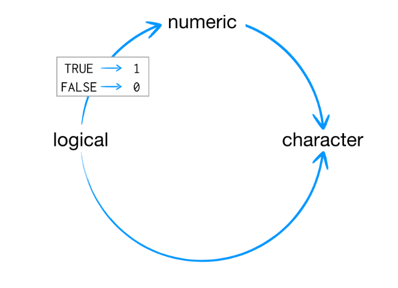

## Conversão explícita

``` r

x <- 0:6
class(x)
[1] "integer"

as.numeric(x)
[1] 0 1 2 3 4 5 6

as.logical(x)
[1] FALSE TRUE TRUE TRUE TRUE TRUE TRUE

> as.character(x)
[1] "0" "1" "2" "3" "4" "5" "6"
```

## Matrizes

-   Matrizes são vetores, com o atributo *dimensão*

    -   O próprio atributo *dimensão* é um vetor

-   São construídas a partir da coluna (primeira à esquerda em diante)

    ```{r, echo=TRUE}
    m <- matrix(1:6, nrow = 2, ncol = 3) 
    m

    dim(m)

    attributes(m)
    ```

------------------------------------------------------------------------

::: callout-tip
As funções *cbind()* e *rbind()* são muito comuns e podem ser utilizadas para criar matrizes:

```{r, echo=TRUE}
x <- 1:4
y <- 10:13

cbind(x,y)

rbind(x,y)
```
:::

## Listas

-   Listas são um tipo especial de vetores
    -   podem conter elementos de diversas classes

        ```{r, echo=TRUE}
        x <- list(1, "a", TRUE, 1 + 4i) 
        x
        ```

------------------------------------------------------------------------

::: {.callout-note style="background-color:#dceeff;"}
Nomes

Os objetos do R também podem ter *nomes* como atributo

-   Facilia a organização o código

-   Interessante para visualizações
:::

------------------------------------------------------------------------

[*Prática*]{.azul}

``` r
    x <- 1:3

    names(x)

    names(x) <- c("Hospital", "UBS", "S.Espec")

    x

    names(x)
```

------------------------------------------------------------------------

Podemos criar listas já com o atributo nome

```{r, echo=TRUE}
x <- list(Hosp = 1:4, UBS = 2, Espec = "Sim")
x
```

## Fatores

-   São utilizados para representar dados categóricos
-   Podem ser ordenados ou não
-   Podem ser vistos como vetores inteiros que possum um rótulo (*label*)
-   São tratados de forma especial em modelagem
-   A odem dos níveis pode ser estabelecida com o argumento *levels* da função *factor()*.
    -   Relevante para modelagem, pois o primeiro nível é utilizado como *baseline*

------------------------------------------------------------------------

```{r, echo=TRUE}

x <- factor(c("sim", "sim", "não", "sim", "não"))
x

table(x)

x <- factor(c("sim", "sim", "não", "sim", "não"),
            levels = c("sim", "não"))
```

::: {style="position: absolute; bottom: 10px; left: 0; width: 100%; text-align: center; opacity: 0.3; font-size: 1.2em;"}
Fatores
:::

## Tipos de Variáveis

::: {.callout-note style="background-color:#f7fbf7;"}
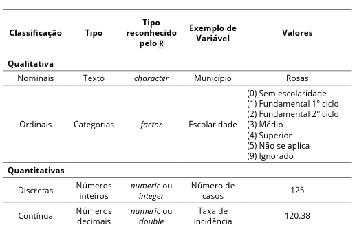
:::

## Valores ausentes (*missing values*)

-   Valores ausentes são denotados por *NA* ou *NaN*

-   *NaN* refere-se a operações matemáticas não definidas

    -   um *NaN* é também um *NA*, mas o inverso não é verdadeiro

-   Podemos usar *is.na( )* para testar se um objeto é *NA*

-   Podemos usar *is.nan( )* para testar se um objeto é *NaN*

    ```{r, echo=TRUE}
    x <- c(1, 2, NA, 10, 3)

    is.na(x)

    is.nan(x)
    ```

## Quadro de dados (*data frames*) {.smaller}

São utilizados para armazenar dados tabulares, tabelas

-   São representados como um tipo especial de lista onde cada elemento da lista possui o mesmo comprimento

-   Cada elemento da lista é como uma **variável**, e o comprimento de cada lista o *número de linhas*

-   Possuem um atributo especial: *row.names*

-   Geralmente são criados chamando *read.table()* ou *read.csv()*

------------------------------------------------------------------------

Também podemos criá-los com a função *data.frame( )*:

```{r, echo=TRUE}
x <- data.frame(paciente = 1:4, retorno = c(T, T, F, F)) 

x

nrow(x)

ncol(x)
```

::: {style="position: absolute; bottom: 10px; left: 0; width: 100%; text-align: center; opacity: 0.3; font-size: 1.2em;"}
Data Frames
:::

## *Subsetting*

-   Refere-se à operação de extrair subconjuntos dos objetos do R

-   Existem formas diferentes, dependendo do tipo de objeto

------------------------------------------------------------------------

### Vetores

-   Utilizamos \[ \]
-   Retorna um subconjunto cujo elemento é da mesma classe do original
-   Pode ser utilizado para selecionar mais de um elemento

::: {style="position: absolute; bottom: 10px; left: 0; width: 100%; text-align: center; opacity: 0.3; font-size: 1.2em;"}
Subsetting
:::

------------------------------------------------------------------------

[*Prática*]{.azul}

``` r
 x <- c("a", "b", "c", "c", "d", "a")
 x[1]
 
 x[2]

x[1:4]

x[x > "a"]
```

::: {style="position: absolute; bottom: 10px; left: 0; width: 100%; text-align: center; opacity: 0.3; font-size: 1.2em;"}
Vetores
:::

### Matrizes

-   Utilizamos\[ \]

-   Consideramos os índices *i* (linhas) e *j* (colunas): *(i,j)*

    ```{r, echo = TRUE}
    x <- matrix(1:6, 2, 3)
    x[1,2]
    x[2,1]
    ```

-   Podemos selecionar apenas linhas ou colunas

    ```{r, echo=TRUE}
    x[1,]
    x[, 2]
    ```

::: {style="position: absolute; bottom: 10px; left: 0; width: 100%; text-align: center; opacity: 0.3; font-size: 1.2em;"}
Subsetting
:::

### Listas

Podemos utilizar \[ \], \[ \[ \] \] ou \$

<br>

```{r, echo = TRUE}

x <- list(Hosp = 1:4, UBS = 2)

x[1]

x[[1]]

x$UBS

x[["UBS"]]

```

::: {style="position: absolute; bottom: 10px; left: 0; width: 100%; text-align: center; opacity: 0.3; font-size: 1.2em;"}
Subsetting
:::

### Data frames

``` r

pacientes <- data.frame(
  id = c(101, 102, 103, 104),
  nome = c("Ana", "Carlos", "Beatriz", "Daniel"),
  idade = c(35, 42, 29, 50),
  hipertensao = c(TRUE, TRUE, FALSE, TRUE),
  glicemia = c(92, 110, 85, 130)
)

# Selecionar a primeira linha, segunda coluna (nome do primeiro paciente)
pacientes[1, 2]    # "Ana"

# Selecionar as duas primeiras linhas, todas as colunas
pacientes[1:2, ]

# Selecionar todas as idades
pacientes[, "idade"]

# Selecionar pacientes com glicemia maior que 100 (potencial risco de diabetes)
pacientes[pacientes$glicemia > 100, ]

# Selecionar pacientes com hipertensão
pacientes[pacientes$hipertensao == TRUE, ]
```

::: {style="position: absolute; bottom: 10px; left: 0; width: 100%; text-align: center; opacity: 0.3; font-size: 1.2em;"}
Subsetting
:::

## Estruturas de controle

-   São mais úteis para escrever **programas** (*scripts*)

-   Permitem controlar o fluxo de execução do *script*

-   Na linha de comando, as funções *apply* são mais úteis

::: {style="position: absolute; bottom: 10px; left: 0; width: 100%; text-align: center; opacity: 0.3; font-size: 1.2em;"}
Estruturas de controle
:::

------------------------------------------------------------------------

Estruturas de controle:

-   if, else

-   for

-   while

-   repeat

-   break

-   next

-   return

::: {style="position: absolute; bottom: 10px; left: 0; width: 100%; text-align: center; opacity: 0.3; font-size: 1.2em;"}
Estruturas de controle
:::

------------------------------------------------------------------------

-   If, else: testam um condição

    ``` r
     if(<condição>) {
            ## faz algo
     } else {
            ## faz outra coisa
     }
    ```

-   

    ``` r
    if(x > 3) {
            y <- 10
     } else {
            y <- 0
     }
    ```

::: {style="position: absolute; bottom: 10px; left: 0; width: 100%; text-align: center; opacity: 0.3; font-size: 1.2em;"}
Estruturas de controle
:::

------------------------------------------------------------------------

-   for: executa um *loop* uma quantidade fixa de vezes\
    [*Prática*]{.azul}

    ``` r
    for(i in 1:10) {
            print(i)
     }
    ```

::: {style="position: absolute; bottom: 10px; left: 0; width: 100%; text-align: center; opacity: 0.3; font-size: 1.2em;"}
Estruturas de controle
:::

------------------------------------------------------------------------

-   while: executa um *loop* enquanto uma condição for verdade

    ``` r

    conte <- 0
     while(conte < 10) {
            print(conte)
            conte <- conte + 1
     }
    ```

::: {style="position: absolute; bottom: 10px; left: 0; width: 100%; text-align: center; opacity: 0.3; font-size: 1.2em;"}
Estruturas de controle
:::

------------------------------------------------------------------------

-   repeat: executa um *loop* infinito

-   break: termina a execução de um *loop*

    ``` r
     x0 <- 1
     tol <- 1e-8
     repeat {
            x1 <- computeEstimate()
            if(abs(x1 - x0) < tol) {
                    break
            } else {
                    x0 <- x1
            } 
    }
    ```

::: {style="position: absolute; bottom: 10px; left: 0; width: 100%; text-align: center; opacity: 0.3; font-size: 1.2em;"}
Estruturas de controle
:::

------------------------------------------------------------------------

::: {.callout-note style="background-color:#dceeff;"}
1e-8 refere-se a *notação científica*\
1e-8 = 1 x 10\^(-8) = 0,00000008

abs( ) é a função que calcula o mótulo, ou valor absoluto
:::

::: {style="position: absolute; bottom: 10px; left: 0; width: 100%; text-align: center; opacity: 0.3; font-size: 1.2em;"}
Estruturas de controle
:::

------------------------------------------------------------------------

-   next: pula interações de um *loop*

    ``` r

     for(i in 1:100) {
     if(i <= 20) {
     ## Pula as primeiras 20 iterações
     next 
            }
     ## Faz algo aqui...
     }
    ```

<!-- -->

-   return: termina a execução de uma função

::: {style="position: absolute; bottom: 10px; left: 0; width: 100%; text-align: center; opacity: 0.3; font-size: 1.2em;"}
Estruturas de controle
:::

------------------------------------------------------------------------

::: {.callout-tip style="background-color:#e6ffe6;"}
Sempre que usar estruturas de controle, fique atento aos { }, que iniciam e fecham seu conteúdo.
:::

::: {style="position: absolute; bottom: 10px; left: 0; width: 100%; text-align: center; opacity: 0.3; font-size: 1.2em;"}
Estruturas de controle
:::

## Funções

-   São mais um tipo de objeto

    -   No lugar de valores, contém código

    -   O código é armazenado em um formato que permite seu uso facilmente, em novas situações

-   São construídas estabelecendo-se seus **argumentos**

-   A função *arg( )* permite ver os argumentos de uma função [*Prática*]{.azul}

    ```{r, echo = TRUE, eval = FALSE}
    # Observando os argumentos de uma função

    args(round)
    ```

------------------------------------------------------------------------

-   Entramos com os argumentos de uma função na ordem em que foram criados

-   Geralmente os dois primeiros argumentos de uma função são conhecidos, então podemos omiti-los

    ```{r, echo=TRUE, eval=FALSE}

    round(x = 1.141598, digits = 2) # argumentos explícitos

    round(1.141598,2) # argumentos implícitos
    ```

::: {style="position: absolute; bottom: 10px; left: 0; width: 100%; text-align: center; opacity: 0.3; font-size: 1.2em;"}
Funções
:::

------------------------------------------------------------------------

::: {.callout-tip style="background-color:#e6ffe6;"}
Boa prática: escrever os nomes dos argumentos a partir do 3º.
:::

::: {style="position: absolute; bottom: 10px; left: 0; width: 100%; text-align: center; opacity: 0.3; font-size: 1.2em;"}
Funções
:::

### Escrevendo suas próprias funções

-   Passamos de 'morador' para 'arquiteto'
-   Uma função tem três componentes básicos

1)  nome
2)  corpo de código
3)  conjunto de argumentos

------------------------------------------------------------------------

Utilizamos a função *function( )*

```{r, echo=TRUE, eval=TRUE}

# Prática

# Exemplo de função criada pelo usuário:

joga_dados <- function() {
  dado <- 1:6
  dados <- sample(dado, size = 2, replace = TRUE)
  sum(dados)
}

# Para chamarmos a função, utilizamos o nome atribuído a ela:

joga_dados() 

# Quando acionamos a função, o R executa o código e retorna o
# resultado da última linha de código

```

::: {style="position: absolute; bottom: 10px; left: 0; width: 100%; text-align: center; opacity: 0.3; font-size: 1.2em;"}
Escrevendo funções
:::

------------------------------------------------------------------------

::: {.callout-tip style="background-color:#e6ffe6;"}
Com o cursos no console, utilize 'seta para cima', para buscar os comandos executados anteriormente.
:::

::: {style="position: absolute; bottom: 10px; left: 0; width: 100%; text-align: center; opacity: 0.3; font-size: 1.2em;"}
Escrevendo funções
:::

------------------------------------------------------------------------

Podemos utilizar argumentos que ainda não tenham sido definidos.\
Neste caso, eles precisam ter valores atribuídos quando chamamos a função.

```{r, echo=TRUE}

# Prática

joga_dados <- function(dado) {
  dados <- sample(dado, size = 2, replace = TRUE)
  sum(dados)
}

joga_dados(dado = 1:4)

```

::: {style="position: absolute; bottom: 10px; left: 0; width: 100%; text-align: center; opacity: 0.3; font-size: 1.2em;"}
Escrevendo funções
:::

------------------------------------------------------------------------

Podemos atribuir valores iniciais ao argumento:

```{r, echo=TRUE, eval=FALSE}

# Prática

joga_dados <- function(dado = 1:6) {
  dados <- sample(dado, size = 2, replace = TRUE)
  sum(dados)
}

joga_dados()

joga_dados(dado = 1:12)

```

::: {style="position: absolute; bottom: 10px; left: 0; width: 100%; text-align: center; opacity: 0.3; font-size: 1.2em;"}
Escrevendo funções
:::

# 5. Lendo os dados [*Prática*]{.azul}

## Lendo os dados .csv

```{r, echo=TRUE, eval=FALSE}

if(!require(readr)) install.packages("readr")
library(readr)

dados <- read_csv2(file = "e_sus_notifica.csv")

```

## Lendo dados .dbf

```{r, echo=TRUE, eval=FALSE}

if(!require(foreign)) install.packages("foreign")
library(foreign)

dados_sinan <- read.dbf(file = 'NINDINET.dbf', as.is = TRUE)

head(dados_sinan)

```

## Lendo dados .xlsx

```{r, echo=TRUE, eval=FALSE}

if(!require(readxl)) install.packages("readxl")
library(readxl)

dados_sivep <- read_excel("sivep_gripe.xlsx",
                          sheet = "SIVEPGRIPE",
                          skip = 0)

```

# 6. Manipulando dados

------------------------------------------------------------------------

-   É parte da pesquisa quantitativa que toma mais tempo
-   Também é onde acontece a maior parte dos erros
-   Quais os problemas de se fazer isso em planilhas eletrônicas? 🤔

------------------------------------------------------------------------

::: {.callout-tip style="background-color:#e6ffe6;"}
Boa prática: indicar todos os pacotes que serão utilizados no começo do script.
:::

```{r, echo=TRUE, eval=TRUE}

if(!require(tidyverse)) install.packages("tidyverse");library(tidyverse) 
if(!require(foreign)) install.packages("foreign");library(foreign) 
if(!require(readxl)) install.packages("readxl");library(readxl)
if(!require(readr)) install.packages("readr");library(readr)
if(!require(janitor)) install.packages("janitor");library(janitor)
if(!require(skimr)) install.packages("skimr");library(skimr)
if(!require(stringr)) install.packages("stringr");library(stringr)
if(!require(stringi)) install.packages("stringi");library(stringi)
if(!require(lubridate)) install.packages("lubridate");library(lubridate)
```

::: {style="position: absolute; bottom: 10px; left: 0; width: 100%; text-align: center; opacity: 0.3; font-size: 1.2em;"}
Manipulando dados
:::

------------------------------------------------------------------------

::: {.callout-tip style="background-color:#e6ffe6;"}
<br> Organize os dados do seu projeto dentro de uma pasta separada, p.e., "Dados"
:::

------------------------------------------------------------------------

## Lendo os arquivos necessários

```{r, echo = TRUE, eval = TRUE}

base <- read.dbf(file = 'Dados/NINDINET.dbf', as.is = TRUE)

CID10 <- read_csv2("Dados/CID-10-CATEGORIAS.CSV",
                   locale = locale(encoding = "latin1"))

dados <- read_csv(file = "Dados/cobertura_hepatiteb_rosas_2016_2020_A.csv")

eapv_2021m <- read_xlsx('Dados/notificacao_eapv_2021m.xlsx')

tabela_municipios <- read_excel("Dados/tabela_municipios.xlsx",
                                sheet = 1,
                                skip = 0)

```

---

::: {.callout-tip style="background-color:#e6ffe6;"}
Para visualizar os tópicos de um arquivo Rmarkdown/Quarto, use 'Alt' + 'o'.
:::

::: {.callout-tip style="background-color:#e6ffe6;"}
Para examinar o código de uma *chunk*, digite 'Alt' + 'e'.
:::

---

O argumento **as.is**:

-   Evita que texto sejam transformadas em fatores de imediato

-   Isso torna a manipulação mais flexível (ex.: limpeza de dados, padronização de strings, etc)

-   Fotores consomem mais memória. Relevante em arquivos grandes

::: {style="position: absolute; bottom: 10px; left: 0; width: 100%; text-align: center; opacity: 0.3; font-size: 1.2em;"}
Manipulando dados
:::

------------------------------------------------------------------------


::: {.callout-tip style="background-color:#e6ffe6;"}
<br> Use 'Ctrl' + F para buscar dentro do seu documento R.

Use 'Replace' para substituir palavras.\
Muito útil quando queremos alterar o comporamento de diversas chunks ao mesmo tempo.
:::

::: {style="position: absolute; bottom: 10px; left: 0; width: 100%; text-align: center; opacity: 0.3; font-size: 1.2em;"}
Manipulando dados
:::

## Visualização inicial dos dados

```{r, echo=TRUE, eval=FALSE}

head(base)

library(tidyverse)
glimpse(base)

```

::: {.callout-tip style="background-color:#e6ffe6;"}
<br> Execute o código da chunk com o 'play', no canto superior direito.

Se uma chunk de código possui diversas saídas (visualizações), clique nos quadros do rstudio abaixo da chunk para visualizar todas as saídas.
:::

## Selecionando variáveis (colunas)

```{r, echo=TRUE, eval=FALSE}

base_menor <- select(base, DT_NOTIFIC, DT_NASC, CS_SEXO, CS_RACA, ID_MN_RESI,
                     ID_AGRAVO)

```

## Piping

O R nos permite utilizar *piping* (encadeamento) para ligar funções.

```{r, echo=TRUE, eval=TRUE}

base_menor <- base |>
  select(DT_NOTIFIC, DT_NASC, CS_SEXO, CS_RACA, ID_MN_RESI, ID_AGRAVO)

```

-   O primeiro argumento da função é passado de antemão
-   Operador de 'pipe' antigo: %\>%
-   Operador do tidyverse: \|\>

------------------------------------------------------------------------

Incluindo mais uma função no pipe

```{r, echo=TRUE, eval=FALSE}

base |>
  select(DT_NOTIFIC, DT_NASC, CS_SEXO, CS_RACA, ID_MN_RESI, ID_AGRAVO) |>
  head()

```

::: {style="position: absolute; bottom: 10px; left: 0; width: 100%; text-align: center; opacity: 0.3; font-size: 1.2em;"}
Piping
:::

## Excluindo colunas

```{r, echo = TRUE, eval = FALSE}

base_menor |>
  select(-DT_NASC) |> 
  head()

```

## Criando colunas

```{r, echo = TRUE, eval = FALSE}

# Criando uma nova variável, tempo de digitação:
base_menor_2 <- base |>
select(NU_NOTIFIC, ID_AGRAVO, DT_NOTIFIC, DT_DIGITA) |>
  mutate(TEMPO_DIGITA = DT_DIGITA - DT_NOTIFIC)

# Visualizando a var DT_DIGITA como numérica
base_menor_2 |>
  mutate(TEMPO_DIGITA = as.numeric(TEMPO_DIGITA)) |>
  head()

```

## Limpando caracteres e padronizando as colunas

```{r, echo = TRUE, eval = FALSE}

# Trabalhando com o banco de dados { `CID-10-CATEGORIAS.CSV } 

# Utilizando a função `colnames()` para checar as variáveis 
colnames(cid10_categorias)

# Utilizando a função `clean_names()` (janitor) para editar o nome das variáveis
cid10_categorias_nova <- clean_names(cid10_categorias)

# Visualizando as variáveis após a transformação
colnames(cid10_categorias_nova)

```

------------------------------------------------------------------------

::: {.callout-tip style="background-color:#e6ffe6;"}
Utilize *'pacote :: funçao'* para especificar de qual pacote vem a função.

Muito útil quando uma função existe em pacotes diferentes.
:::

```{r, echo = TRUE, eval = FALSE}
# Utilizando a função `clean_names()` (janitor) para editar o nome das variáveis
cid10_categorias_nova <- janitor::clean_names(cid10_categorias)

names(cid10_categorias_nova) # A função 'names( )' é mais geral que a 'colnames( )'.
```

::: {style="position: absolute; bottom: 10px; left: 0; width: 100%; text-align: center; opacity: 0.3; font-size: 1.2em;"}
Limpando caracteres e padronizando as colunas
:::

## Filtrando colunas

```{r, echo = TRUE, eval = FALSE}

# Filtrando os CIDs igual a B19, da coluna "ID_AGRAVO"
# com tempo de digitação maior que sete dias
base_menor_2 |>
  filter(ID_AGRAVO == "B19", TEMPO_DIGITA > 7) |>
  head()

# Filtrando os registros iguais a B19 OU A279 OU B54 na coluna "ID_AGRAVO"
base_menor_2 |>
  filter(ID_AGRAVO == "B19" | ID_AGRAVO == "A279" | ID_AGRAVO == "B54") |>
  head(20)

# Fazendo o mesmo filtro utilizando o operador `%in%`
base_menor_2 |>
  filter(ID_AGRAVO %in% c("B19", "A279", "B54")) |>
  head(20)

```

## Sumarizando colunas

```{r, echo = TRUE, eval = FALSE}

# Agrupando as notificações pelos agravos e contando a frequência de notificações
base_menor_2 |>
  group_by(ID_AGRAVO) |>
  count(ID_AGRAVO) |>
  print(n = 20)

```

------------------------------------------------------------------------

```{r, echo = TRUE, eval = FALSE}

base_menor_2 |>
  
  # Agrupando as notificações pelos agravos
  group_by(ID_AGRAVO) |>
  
  # Utilizando a função `summarise()` para criar novas colunas de síntese
  summarise(
    
    # Criando uma coluna de total, utilizando a função `n()`
    total_agravos = n(),
    
    # Criando uma coluna de média, utilizando a função `mean()`
    media_digita = mean(TEMPO_DIGITA)
  )

```

::: {style="position: absolute; bottom: 10px; left: 0; width: 100%; text-align: center; opacity: 0.3; font-size: 1.2em;"}
Sumarizando colunas
:::

## Modificando a ordem das colunas

```{r, echo = TRUE, eval = FALSE}

base_menor_2 |>
  
  # Agrupando as notificações pelos agravos
  group_by(ID_AGRAVO) |>
  
  # Utilizando a função `summarise()` para criar novas colunas de síntese
  summarise(total_agravos = n(),
            media_digita = mean(TEMPO_DIGITA)) |>
  
  # Ordenando a tabela pela ordem decrescente da média de tempo de digitação
  arrange(desc(media_digita))

```

## Avaliando a completude dos dados

```{r, echo = TRUE, eval = FALSE}

base |>
  
  # Utilizando a função `summarise()` para criar novas colunas de síntese
  summarise(
    
    # Criando uma coluna com a soma de todos os registros da variável raça/cor devidamente preenchidos
    total_completo = sum(!is.na(CS_RACA)),
    
    # Criando uma coluna com o total de registros na tabela
    total_registros = n(),
    
    # Criando uma coluna com a soma de registros com a variável raça/cor em branco
    total_missing_raca = sum(is.na(CS_RACA)),
    
    # Criando uma coluna de porcentagem de completude (preenchimento)
    taxa_completude = (total_completo / total_registros) * 100
  )

```

::: {.callout-note style="background-color:#dceeff;"}
Em programação, "!" é utilizado para negar uma expressão lógica.
:::

## Renomeando valores

```{r, echo = TRUE, eval = FALSE}

base |>
  
  # Contabilizando o número de registros conforme as categorias de preenchimento
  # da variável "CS_RACA"
  count(CS_RACA)

base |>
  
  # Transformando os valores em branco em 9 na coluna "CS_RACA"
  mutate(CS_RACA = replace_na(CS_RACA, replace = 9)) |>
  
  # Contabilizando o número de registros conforme as categorias de preenchimento
  # da variável "CS_RACA"
  count(CS_RACA)

```

## Transformando os dados no formato largo em formato longo

---

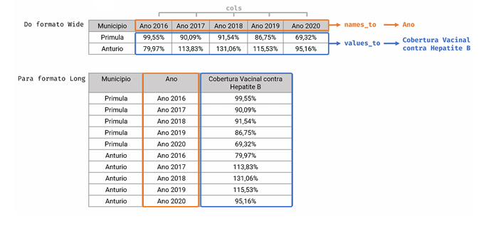

---

```{r, echo = TRUE, eval = FALSE}

# Trabalhando com o banco de dados `cobertura_hepatiteb_rosas_2016_2020_A.csv 

# Criando o objeto {`dados_longos`}
dados_longos <- dados |>
  
  # Utilizando a função `pivot_longer()` para transformação de colunas
  pivot_longer(
    
    # Definindo as colunas que serão transformadas
    cols = c("Ano 2016", "Ano 2017", "Ano 2018", "Ano 2019", "Ano 2020"),
    
    # Definindo o nome da variável nova que receberá os nomes acima
    names_to = "Ano",
    
    # Definindo o nome da variável nova que receberá os valores da tabela
    values_to = "Cobertura Vacinal contra Hepatite B",
    
    # Retirando a palavra "Ano " antes de cada valor da variável Ano
    # Também estamos retirando o espaço depois da palavra "Ano"
    names_prefix = "Ano "
  )
# Visualizando a tabela {`dados_longos`} no formato longo
dados_longos

```

## Transformando os dados do formato longo em formato largo

```{r, echo = TRUE, eval = FALSE}

# Criando o objeto {`dados_largos`}
dados_largos <- dados_longos |>
  
  # Utilizando a função `pivot_wider()` para transformação de colunas
  pivot_wider(
    
    # Definindo de qual variável estamos resgatando os nomes das colunas
    names_from = "Ano",
    
    # Definindo de qual variável estamos resgatando os valores das colunas
    values_from = "Cobertura Vacinal contra Hepatite B")

# visualizando a tabela
dados_largos

```

## Separarando o conteúdo de uma variável em várias colunas

```{r, echo = TRUE, eval = FALSE}

# Trabalhando com o banco de dados `notificacao_eapv_2021m.xlsx`

# Visualizando a tabela {`eapv_2021m`} com a função `View()
View(eapv_2021m)

# Selecionando e visualizando variáveis específicas
eapv_2021m |>
  
  # Selecionando três colunas do data.frame {`eapv_2021m`}
  select(imunobiologico_vacina, dose, data_da_aplicacao) |>
  
  # Utilizando a função `head()` para visualizar as primeiras linhas da tabela
  head()

```

------------------------------------------------------------------------

```{r, echo = TRUE, eval = FALSE}

eapv_2021m |>
  # Dividindo a coluna `imunobiologico_vacina` em três novas colunas
  separate(
    # Definindo a coluna que será separada
    col = imunobiologico_vacina,
    # Definindo os nomes das novas colunas
    into = c("vac_event_1", "vac_event_2", "vac_event_3"),
    # Definindo qual o caractere que está sendo utilizado dentro das colunas
    sep = "\\|"
  ) |>
  # Selecionando as novas colunas para visualização
  select("vac_event_1", "vac_event_2", "vac_event_3")

```

::: {style="position: absolute; bottom: 10px; left: 0; width: 100%; text-align: center; opacity: 0.3; font-size: 1.2em;"}
Separarando o conteúde uma variável em várias colunas
:::

## Recodificando linhas e colunas

```{r, echo = TRUE, eval = FALSE}

base_menor |>
  # Renomeando os valores da variável CS_SEXO usando a função `mutate()` e `case_when()`
  mutate(
    sexo_cat = case_when(
      CS_SEXO == "M" ~ "Masculino",
      CS_SEXO == "F" ~ "Feminino",
      CS_SEXO == "I" | is.na(CS_SEXO) ~ "Ignorado",
      TRUE ~ NA_character_
    )
  ) |>
  # Visualizando a tabela {`base_menor`} recodificada
  head()

```

------------------------------------------------------------------------

```{r, echo = TRUE, eval = FALSE}
base_menor <- base_menor |>
  mutate(
    raca_cor_cat = case_when(
      # Se o valor da coluna for igual a "1" transforme para "Branca"
      CS_RACA == "1" ~ "Branca",
      # Se o valor da coluna for igual a "2" transforme para "Preta"
      CS_RACA == "2" ~ "Preta",
      # Se o valor da coluna for igual a "3" transforme para "Amarela"
      CS_RACA == "3" ~ "Amarela",
      # Se o valor da coluna for igual a "4" transforme para "Parda"
      CS_RACA == "4" ~ "Parda",
      CS_RACA == "5" ~ "Indígena",
      CS_RACA == "9" | is.na(CS_RACA) ~ "Ignorado",
      TRUE ~ NA_character_
    )
  ) |>
  head()
```

::: {style="position: absolute; bottom: 10px; left: 0; width: 100%; text-align: center; opacity: 0.3; font-size: 1.2em;"}
Recodificando linhas e colunas
:::

------------------------------------------------------------------------

```{r, echo = TRUE, eval = FALSE}

base |>
  # Utilizando a função `mutate()` para criar colunas
  mutate(
    # Criando uma coluna de idade conforme a codificação da variável NU_IDADE_N
    idade_anos = if_else(str_sub(NU_IDADE_N, start = 1, end =  1) == "4", 
                         as.numeric(str_sub(NU_IDADE_N, start = 2, end =  4)), 0),
    # Criando uma coluna de faixa etária a partir da variável idade dos casos notificados
    # utilizando a função `cut()`
    fx_etaria = cut(
      # Definindo qual variável será classificada em faixas
      x = idade_anos,
      # Definindo os pontos de corte das classes
      breaks = c(0, 10, 20, 60, Inf),
      # Definindo os rótulos das classes
      # Definindo o tipo do ponto de corte
      right = FALSE
    )
  ) |>
  select(NU_IDADE_N,idade_anos,fx_etaria,everything()) # Muda ordem de visualização

```

::: {style="position: absolute; bottom: 10px; left: 0; width: 100%; text-align: center; opacity: 0.3; font-size: 1.2em;"}
Recodificando linhas e colunas
:::

---

::: {.callout-tip style="background-color:#e6ffe6;"}
<br>
Comentários do meio da linha podem ser úteis, mas podem dificultar a visualização
do código.
:::

```{r, echo = TRUE, eval = FALSE}

# Observe o mesmo código, sem comentários.

base |>
  mutate(
    idade_anos = if_else(str_sub(NU_IDADE_N, 1, 1) == "4", 
                         as.numeric(str_sub(NU_IDADE_N, 2, 4)), 0),
    fx_etaria = cut(
      x = idade_anos,
      breaks = c(0, 10, 20, 60, Inf),
      right = FALSE
    )
  ) |>
  select(NU_IDADE_N,idade_anos,fx_etaria,everything())

```

## Unindo tabelas (bases de dados)

| Função         | Descrição |
|----------------|------------------------------------------------------|
| `inner_join()` | Retorna apenas as observações que têm correspondência nas duas tabelas.                   |
| `left_join()`  | Retorna **todas** as observações da tabela da **esquerda**, com correspondências da direita (se houver). |
| `right_join()` | Retorna **todas** as observações da tabela da **direita**, com correspondências da esquerda. |
| `full_join()`  | Retorna **todas** as observações de ambas as tabelas (união completa).                    |

---

```{r, echo = TRUE, eval = FALSE}

## Verificando o tipo de variável na coluna `ID_MN_RESI` do NINDINET

class(base_menor$ID_MN_RESI)

# Vamos utilizar o banco 'tabela_municípios.xlsx'.

class(tabela_municipios$ID_MUNICIPIO)

## Transformando apenas a variável `ID_MUNICIPIO` do data.frame {`tabela_municipios`}
## em 'integer'

tabela_municipios$ID_MUNICIPIO <- as.integer(tabela_municipios$ID_MUNICIPIO)

left_join(
  # Unindo a tabela {`base_menor`}
  x = base_menor,
  # com a tabela {`tabela_municipios`}
  y = tabela_municipios,
  # Selecionando as colunas `ID_MN_RESI` e `ID_MUNICIPIO` para unir os bancos de dados
  by = c("ID_MN_RESI" = "ID_MUNICIPIO")) |>
  # Visualizando a união realizada
head()

```

::: {style="position: absolute; bottom: 10px; left: 0; width: 100%; text-align: center; opacity: 0.3; font-size: 1.2em;"}
Unindo tabelas
:::

# 7. Lidando com textos

## Contando caracterres e extraindo textos

```{r, echo = TRUE, eval = FALSE}

# Criando um novo objeto com as seleções feitas (dados CID-10-CATEGORIAS.CSV)

nomes_cid <- CID10 |>
  # Selecionar apenas as linhas de interesse (linhas 1 a 15)
  slice(1:15) |> 
  # Selecionando apenas a variável "DESCRICAO" e transformando em `character` simples
  pull(DESCRICAO)

nomes_cid

# Contando quantos caracteres existem em cada linha
str_length(nomes_cid)

# Extraindo caracteres entre a 1ª e a 11ª posição da linha
str_sub(nomes_cid, start = 1, end = 11)

# Indicando a posição final da primeira palavra de cada texto
str_sub(nomes_cid, 
        start = 1, 
        end = c(6,6,6,10,6,6,8,6,9,8,11,11,11,11,11))

# Extraindo a primeira palavra
word(nomes_cid, 1, sep = " ")

```

## Alterando a ordem e reordenando texto

```{r, echo = TRUE, eval = FALSE}

# Ordenando o objeto {`nomes_cid`} para o formato ascendente (A-Z)
str_sort(nomes_cid)

# Ordenando o objeto {`nomes_cid`} para o formato decrescente (Z-A)
str_sort(nomes_cid, decreasing = TRUE)

```

## Unindo *strings*

```{r, echo = TRUE, eval = FALSE}

# Unindo **strings** para a formação da palavra "Tuberculose"
str_c("Tuber","culo","se")

# Unindo **strings** incluindo espaço entre elas
# adicionaremos o argumento `sep = " "`
str_c("Tuberculose","respiratória,","com","confirmação",
      "bacteriológica","e histológica", sep = " ")

# Salvando as modificações no objeto {`agravo`}
agravo <- c("Tuberculose","respiratória,","com","confirmação",
            "bacteriológica","e histológica")

# Unindo **strings** armazenadas no objeto {`agravo`}
# em um único *string* de texto
str_c(agravo, collapse = " ")

```

## Transformando *strings*

```{r, echo = TRUE, eval = FALSE}

# Transformando todos as letras em maiúsculas
str_to_upper(nomes_cid)

# Transformando todos as letras em minúsculas
str_to_lower(nomes_cid)

# Transformando apenas a primeira maiúscula e restante das palavras em minúsculas
str_to_sentence(nomes_cid)

# Padronizando a escrita (pacote stringi)

# Vetor com diferentes grafias

nomes <- c("infecções", "infeccões", "infecçoes", "infeccoes")

# Transformação das letras especiais ou com acentuação
stri_trans_general(nomes, id = "Latin-ASCII")

```


## Identificando padrões em *strings*

```{r, echo = TRUE, eval = FALSE}

# Extraindo linhas onde a palavra "Tuberculose" aparece
str_subset(nomes_cid, pattern = "Tuberculose")

# Extraindo linhas onde a palavra "tuberculose" aparece, independente se
# maiúscula ou minúscula
str_subset(nomes_cid, pattern = fixed("tuberculose", ignore_case = TRUE))

```

---

```{r, echo = TRUE, eval = FALSE}

# Encontrando padrões no início do texto

CID10 |> 
  filter(
    str_starts(
      # Utilizando a função `filter()` com a função `str_stars()`
      # Selecionando a variável usada para encontrar palavras no início da frase
      string = DESCRICAO,
      # Definindo a palavra a ser pesquisada e ignorando se maiúscula ou minúscula
      pattern = fixed("outras", ignore_case = TRUE)
    )
  ) |> 
  # Selecionando as variáveis que queremos utilizar com a função `select()`
  select(CAT, DESCRICAO)

```

---

```{r, echo = TRUE, eval = FALSE}

# Encontrando padrões no final do texto

CID10 |> 
  # Utilizando a função `filter()` com a função `str_ends()`
  filter(
    str_ends(
      # Definindo a variável usada para encontrar palavras no final da frase
      string = DESCRICAO,
      # Definindo a palavra a ser pesquisada e ignorando se maiúscula ou minúscula
      pattern = fixed("bacterianas", ignore_case = 
                        TRUE)
    )
  ) |> 
  # Selecionando as variáveis que queremos utilizar com a função `select()
  select(CAT, DESCRICAO)

```

## Substituindo valores de texto

```{r, echo = TRUE, eval = FALSE}

# Criando um vetor de texto
agravo <- "Tuberculose respiratória, com confirmação bacteriológica e histológica"

# Substituindo palavras
str_replace(agravo, pattern = "com", replacement = "sem")

# Criando um vetor de texto
agravo <- "Tuberculose respiratória, com confirmação bacteriológica e histológica"

# Substituindo palavras
str_replace_all(agravo, pattern = "ó", replacement = "o")

```

# 9. Organizando os eventos no tempo

## Transformando datas

```{r, echo = TRUE, eval = FALSE}

# Transformando uma string em data
data_1 <- as_date("2022-05-19")
# Visualizando a string transformada em data
data_1

# Verificando a classe do objeto `data_1`
class(data_1)

# Transformando uma string em data sem definir o formato
as_date("19/05/2022")

# Transformando uma string em data definindo o formato
as_date("19/05/2022", format = "%d/%m/%Y")

# Transformando uma string do tipo das datas do SIM definindo o formato
as_date("01031998", format = "%d%m%Y")


```

## Cálculo com datas

```{r, echo = TRUE, eval = FALSE}

dt_notific <- read.dbf(file = 'Dados/NINDINET.dbf') |>
  # Selecionando as variáveis que queremos utilizar com a função `select()`
  select(DT_NOTIFIC, DT_SIN_PRI, DT_NASC) |>
  # Selecionar apenas as linhas de interesse (linhas 1 a 10)
  slice(1:10)

dt_notific

```

---

```{r, echo = TRUE, eval = FALSE}

# Somando 60 dias às datas de notificação de casos da tabela {`dt_notific`}
dt_notific$DT_NOTIFIC + 60

# Subtraindo 60 dias as datas de notificação 
#de casos à tabela {`dt_notific`}
dt_notific$DT_NOTIFIC - 60

# Criando a tabela {`dt_notific_2`}
dt_notific_2 <- dt_notific |>
  # Selecionando as variáveis que queremos utilizar com a função `select()`
  select(DT_NOTIFIC) |>
  # Utilizando a função `mutate()` para criar a nova coluna "prazo_encerramento"
  mutate(prazo_encerramento = DT_NOTIFIC + 60) 

dt_notific_2

```

::: {style="position: absolute; bottom: 10px; left: 0; width: 100%; text-align: center; opacity: 0.3; font-size: 1.2em;"}
Cálculo com datas
:::

---

```{r, echo = TRUE, eval = FALSE}

# Criando a tabela com a diferença entre 'DT_NOTIFIC' e 'DT_SIN_PRI'

dif_tempo <- dt_notific |>
  # Selecionando as variáveis que queremos utilizar com a função `select()`
  select(DT_NOTIFIC, DT_SIN_PRI) |>
  # Utilizando a função `mutate()` para criar a nova coluna "DIFERENCA"
  mutate(DIFERENCA = DT_NOTIFIC - DT_SIN_PRI)

# Obtendo o resultado como inteiro
dif_tempo_2 <- dt_notific |>
  # Selecionando as variáveis que queremos utilizar com a função `select()`
  select(DT_NOTIFIC, DT_SIN_PRI) |>
  # Utilizando a função `mutate()` para criar a nova coluna "Diferenca"
  mutate(Diferenca = as.integer(DT_NOTIFIC - DT_SIN_PRI))

dif_tempo_2

```

::: {style="position: absolute; bottom: 10px; left: 0; width: 100%; text-align: center; opacity: 0.3; font-size: 1.2em;"}
Cálculo com datas
:::

---

```{r, echo = TRUE, eval = FALSE}

# Encontrando a idade em anos, com arredondamento

idade <- dt_notific |>
  # Selecionando as variáveis que queremos utilizar com a função `select()`
  select(DT_NASC, DT_SIN_PRI) |>
  # Utilizando a função `mutate()` para criar as novas colunas de idade
  mutate(
    IDADE_DIAS = as.integer(DT_SIN_PRI - DT_NASC),
    IDADE_ANOS = floor(IDADE_DIAS / 365.25)
  )

```

::: {style="position: absolute; bottom: 10px; left: 0; width: 100%; text-align: center; opacity: 0.3; font-size: 1.2em;"}
Cálculo com datas
:::

## Extrações de elementos de data

```{r, echo = TRUE, eval = FALSE}

# Extrai o ano (lubridate)
year(dt_notific$DT_NOTIFIC)

# Extrai o mês
month(dt_notific$DT_NOTIFIC)

# Extrai o dia
day(dt_notific$DT_NOTIFIC)

# Extrai o dia da semana
wday(dt_notific$DT_NOTIFIC)

# Com o dia da semana abriado
wday(dt_notific$DT_NOTIFIC, label = TRUE)

# Nome do dia da semana, sem abreviação
wday(dt_notific$DT_NOTIFIC, label = TRUE, abbr = FALSE)

```

---

```{r, echo = TRUE, eval = FALSE}

# Identificando a semana epidemiológica nas datas

# Transformando todas as datas da variável `DT_NOTIFIC`
# da tabela {`dt_notific`} em semana epidemiológica 
# com a função `epiweek()`
epiweek(dt_notific$DT_NOTIFIC)

# Alterando a tabela {`dt_notific_2`}
dt_notific_2 <- dt_notific |>
  # Utilizando a função `mutate()` para criar novas colunas
  mutate(
    # Criando variável ano a partir da data de notificação
    # utilizando a função `year()`
    ano = year(DT_NOTIFIC),  
    # Criando variável mes a partir da data de notificação
    # utilizando a função `month()`
    mes = month(DT_NOTIFIC), 
    # Criando variável dia a partir da data de notificação
    # utilizando a função `day()`
    dia = day(DT_NOTIFIC),
    # Criando variável semana_num a partir da data de notificação
    # utilizando a função `wday()`
    semana_num = wday(DT_NOTIFIC), 
    # Criando variável semana_nome a partir da data de notificação
    # utilizando a função `wday()`
    semana_nome = wday(DT_NOTIFIC, label = TRUE),
    # Criando variável semana_nome_completo a partir da data de notificação
    # utilizando a função `wday()`
    semana_nome_completo = wday(DT_NOTIFIC, label = TRUE, abbr = FALSE),
    # Criando variável semana_epidemiológica a partir da data de notificação
    # utilizando a função `epiweek()`
    semana_epidemiologica = epiweek(DT_NOTIFIC)
  )

dt_notific_2

```

::: {style="position: absolute; bottom: 10px; left: 0; width: 100%; text-align: center; opacity: 0.3; font-size: 1.2em;"}
Cálculo com datas
:::

---

```{r, echo = TRUE, eval = FALSE}

#  Agregando e indicando a data de final da semana epidemiológica

# Criando a tabela {`dt_notific_5`}
dt_notific_5 <- dt_notific |>
  # Selecionando as variáveis que queremos utilizar com a função `select()`
  select(DT_NOTIFIC) |>
  # Utilizando a função `mutate()` para criar as novas variáveis
  mutate(
    dia_semana = wday(DT_NOTIFIC),
    dif_dia_semana = 7 - dia_semana,
    DT_semana_epi = DT_NOTIFIC + dif_dia_semana
  )

dt_notific_5

# Outra forma

# Criando a tabela {`dt_notific_6`}
dt_notific_6 <- dt_notific |>
  # Selecionando as variáveis que queremos utilizar com a função `select()`
  select(DT_NOTIFIC) |>
  # Utilizando a função `mutate()` para criar a nova coluna
  mutate(DT_semana_epi = DT_NOTIFIC + 7 - wday(DT_NOTIFIC))

dt_notific_6

```

::: {style="position: absolute; bottom: 10px; left: 0; width: 100%; text-align: center; opacity: 0.3; font-size: 1.2em;"}
Cálculo com datas
:::

## Sequência de datas

```{r, echo = TRUE, eval = FALSE}

# Criando uma sequência de datas, criando dias de uma semana
as.Date("2022-01-01") + 0:7

# Criando uma sequência de datas
seq.Date(from = as.Date("2022-01-01"), to = as.Date("2022-02-01"), by = "day")

```


# 10. Exportação dos dados

```{r, echo = TRUE, eval = FALSE}

# Salvando a tabela {base_menor} em seu computador na pasta "Meus documentos"
write_csv(x = base_menor,
          file = "C:/Users/UFR/Documents/Curso_CDPS/Dados/base_menor_curso.csv")

install.packages("writexl");library(writexl)
# Salvando a tabela {base_menor} em seu computador na pasta "Meus documentos"
write_xlsx(x = base_menor,
           path = "C:/Users/UFR/Documents/Curso_CDPS/Dados/base_menor_curso/Dados/base_menor_curso.xlsx")

```

# 11. Referências

## Referências Principais {.smaller}

ABRASCO, **Analise de dado para Vigilância em Saúde - Curso Básico**, 2022.  
Módulos 1 a 3.

Wickham, H.; Cetinkaya-Rundel, M.; Grolemund, G. **R for data science**, 2023.  
<https://r4ds.hadley.nz/>

Grolemund, G. **Hands-on programming with R**, 2014.  
<https://rstudio-education.github.io/hopr/>

Peng, R. D. **R Programming for Data Science**, 2015.

## Outras Referências {.smaller}

*Análises Ecológicas no R*  
<https://analises-ecologicas.netlify.app/index.html>

*Ciência de Dados em R*  
<https://livro.curso-r.com/index.html>

*Ciência de Dados em R*  
<https://livro.curso-r.com/index.html>

*Zen do R*  
<https://curso-r.github.io/zen-do-r/>

*Introdução à Linguagem R: seus fundamentos e sua prática*  
<https://pedropark99.github.io/Introducao_R>

*Ciência de Dados em R*  
<https://livro.curso-r.com/index.html>

*Análises Ecológicas no R*  
<https://analises-ecologicas.netlify.app>

*Introdução à Linguagem R: seus fundamentos e sua prática*  
<https://pedropark99.github.io/Introducao_R>

*Fundamentos de Estatística para Ciência de Dados*  
<http://filipezabala.com/fdepcdd/>

*Introdução à Ciência de Dados*  
<https://rafalab.github.io/dslivro/>

*Happy Git and GitHub for the useR*  
<https://happygitwithr.com/>

*R Cookbook*  
<https://rc2e.com/>


